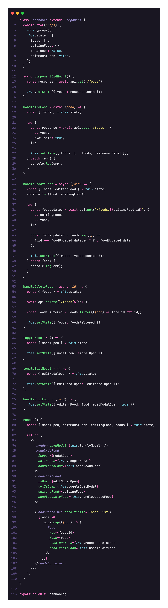
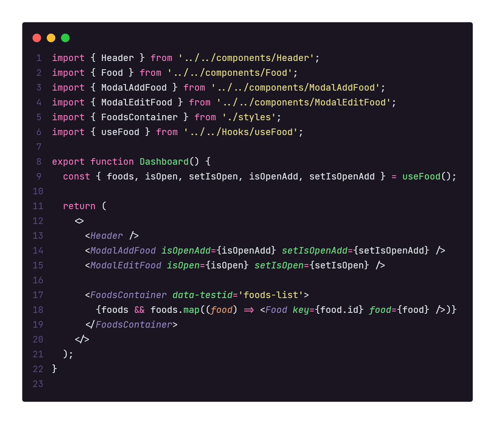

# Ignite Chapter II

  

  

## Projeto: GoRestaurant

Desafio extra Capitulo 2 Ignite. 

O desafio consistia em refatorar um código que era escrito em Class Components para Function Components. 
Após isso tinha que fazer a migração de JavaScript para TypeScript. 

O primeiro passo que tomei , foi verificar como a aplicação funcionava, após uma boa lida nos códigos, comecei, geralmente eu começo dos códigos filhos para os pais. 

Conforme avançava já ia pensando o que poderia melhorar. Fiz o uso do bom e velho **ContextApi** levando em conta que muitas das informações seriam passado por varios componentes. Já aproveitei para praticar um pouco mais. 

A Aplicação contava com uma FakeApi feita em JSON server, a mesma era consumida com axios.

Acho que no final o maior desafio foi lidar com a Tipagem do **Typescript**, não sei se ficou bom no final, mas tentei fazer meu melhor. 

Logo abaixo imagem do antes e depois do código do Dashboard.

## Tecnologias

 - React 
 - Typescript 
 - Styled-Components 
 - axios 
 - MirageJs 
 - React-Modal

### Para a instalação 
Copie o repositório com o git clone #url;  
Apos isso execute **yarn** para instalação das dependências;  
E então de um **yarn start** para a aplicação rodar no seu Navegador;  
Não esqueça do **yarn server** para iniciar a fakeApi; 

### Prints da Aplicação
Todo o layout foi feito pela @RocketSeat 

**Antes**

**Depois**

